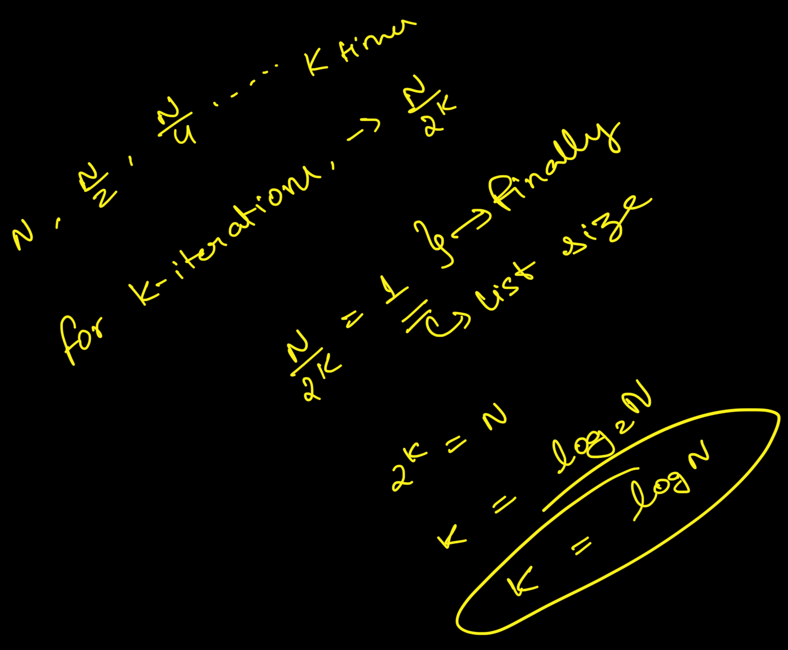
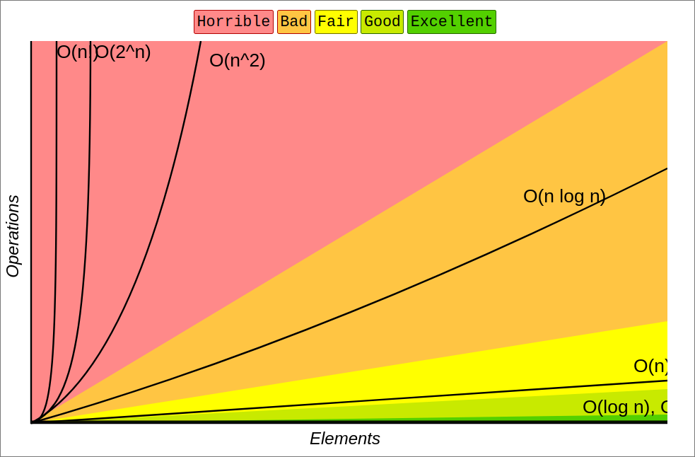

# Complexity and Big O Notation

>**Complexity** of an algorithm is a measure of the amount of time and/or space required by an algorithm for an input of a given size e.g. N. Unless otherwise stated, **the term complexity always refers to the worst-case complexity** (i.e. the highest possible time/space taken by the program/algorithm to process an input).

In the case of linear search:

  - The time complexity of the algorithm is cN for some fixed constant **c that depends on the number of operations we perform in each iteration** and the time taken to execute a statement. Time complexity is sometimes also called the running time of the algorithm.

  - The space complexity is some constant c' **(independent of N)**, since we just need a single variable position to iterate through the array, and it occupies a constant space in the computer's memory (RAM).


## Big O Notation
Worst-case complexity is often expressed using the Big O notation. 
In the Big O, we drop fixed constants and lower powers of variables
to capture the trend of relationship between the size of the input and the complexity of the algorithm 
i.e. if the complexity of the algorithm is **cN^3 + dN^2 + eN + f**, in the Big O notation **it is expressed as O(N^3)**

### Binary Search time complexity 


## Differences between Linear Search and Binary Search

The actual benefit of BS is visible with very large inputs. 
Binary search runs `c * N / logN` times faster than linear search, for some fixed constant c . 
Since log N grows very slowly compared to N, the difference gets larger with the size of the input. 

Here's a graph showing different Big O Notations



# Generic Binary Search

Here is the general strategy behind binary search, which is applicable to a variety of problems:
1. Come up with a condition to determine whether the answer lies before, after or at a given position
2. Retrieve the midpoint and the middle element of the list.
3. If it is the answer, return the middle position as the answer.
4. If answer lies before it, repeat the search with the first half of the list
5. If the answer lies after it, repeat the search with the second half of the list.

Implementation in Python:
```python
def binary_search(lo, hi, condition):
    """TODO - add docs"""
    while lo <= hi:
        mid = (lo + hi) // 2
        result = condition(mid)
        if result == 'found':
            return mid
        elif result == 'left':
            hi = mid - 1
        else:
            lo = mid + 1
    return -1
```