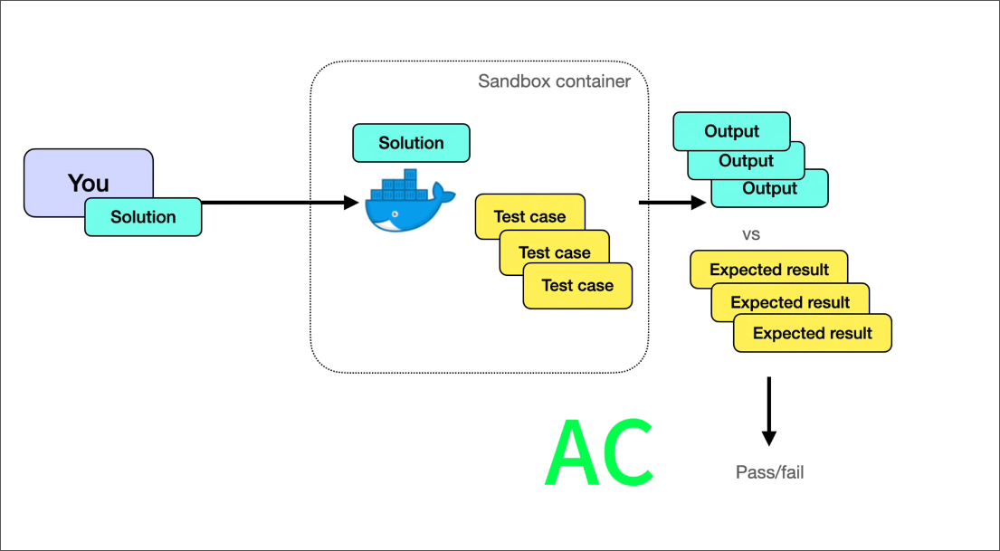
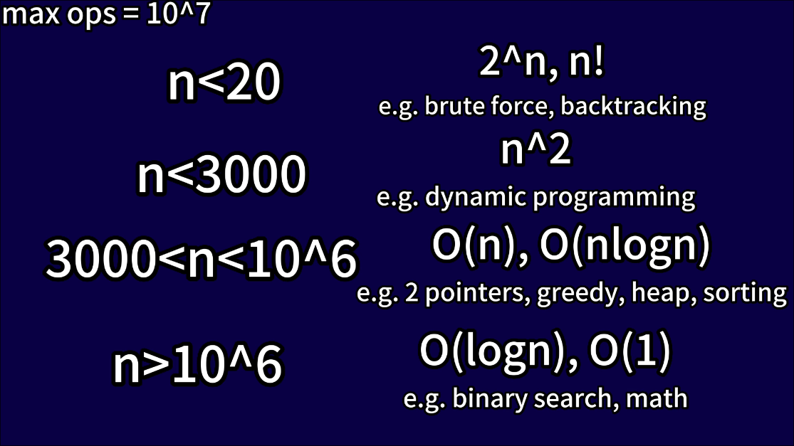

# Time Complexity

## What constraints tells us about?

When we are presented with contraints like these, we usually ignore them at first (when we are just starting out), BUT these constraints play a major role: 

> Based on these contraints we can infer what time complexity our solution should have 

### What happens when we submit our solution in these platforms? 

Expand Here

 

Video Link: [Youtube Link](https://www.youtube.com/watch?v=eB7SMsE6qEc&t=289s)

- These docker containers usually have a time limit to run, once the time limit is reached it gives us **TLE**

> Now it's observed that max number of operations generally allowed before hitting a timeout is about 10 to 20 million

> These are just workarounds and not strict guidelines

## Try to Remember

### O(1)

Constant time complexity. Could be

- Hashmap lookup
- Array access and update
- Pushing and popping elements from a stack
- Finding and applying math formula
- Typically for `n > 10⁹`

### O(log(N))

- log(N) grows VERY slowly. log(1,000,000) is only about 20. 
- In fact, lookup by primary key in a relational database is log(N) (many mainstream relational databases such as postgres use B-trees for indexing by default, and searching in a B-tree is log(N)).

In coding interviews, log(N) typically means

- Binary search or variant
- Balanced binary search tree lookup
- Processing the digits of a number
- Typically for `n > 10⁸`

> Note: Unless specified, we assume that log(N) refers to log₂(N) or "log base 2 of N"

### O(N)

Linear time typically means looping through a linear data structure a constant number of times. Most commonly, this means

- Going through array/linked list
- Two pointers
- Some types of greedy
- Tree/graph traversal
- Stack/Queue
- Typically for `n ≤ 10⁶`

### O(K log(N))

- **Heap push/pop K times**. When you encounter problems that seek the "**top K elements**", you can often solve them by pushing and popping to a heap K times, resulting in an O(K log(N)) runtime. 
  - e.g., K closest points, merge K sorted lists.
- Binary search K times.
- Typically for `n ≤ 10⁶`

### O(N log(N))

- **Sorting**. The default sorting algorithm's expected runtime in all mainstream languages is N log(N). For example, java uses a variant of merge sort for object sorting and a variant of Quick Sort for primitive type sorting.
- **Divide and conquer with a linear time merge operation**. **Divide is normally log(N)**, and if merge is O(N) then the overall runtime is O(N log(N)). An example problem is smaller numbers to the right.
- Typically for `n ≤ 10⁶`

### O(N^2)

Also called quadratic time.

- Nested loops, e.g., visiting each matrix entry
- Many brute force solutions
- Typically for `n ≤ 3000`

For small N < 1000, this is not that bad for modern computers. You can probably pass most Leetcode tests with quadratic time for tiny Ns. 

However, in an interview, your solution usually has to do better than quadratic time to impress the interviewer if there is a better solution.

### O(2^N)

Grows very rapidly. Often requires **memoization (an optimization technique to speed up programs by storing results of expensive function calls and reusing them)** to avoid repeated computations and reduce complexity.

- Combinatorial problems, **backtracking**, e.g. subsets
- Often involves recursion and is harder to analyze time complexity at first sight
- Further detailed code examples can be found in the backtracking section
- Typically for `n ≤ 20`

A recursive Fibonacci algorithm is O(2^N) because for any Fib(i) where i > 1, we call Fib(i - 1) and Fib(i - 2).

### O(N!)

Grows insanely rapidly. Only solvable by computers for small N. Often requires memoization to avoid repeated computations and reduce complexity.

- Combinatorial problems, backtracking, e.g. permutations
- Often involves recursion and is harder to analyze time complexity at first sight
- Detailed code examples can be found in the backtracking section
- Typically for `n ≤ 12`

### Amortized Time Complexity

- The idea of amortized time is doing a very costly task once in a while. 
- The costly task is done so rarely that it is dilluted away. 
  - For example, if we had N O(1) tasks but only a single O(N) task, we could still consider the total O(N) instead of O(N^2) if N is large enough.

The key takeaway is that amortized time is the average time taken per operation.