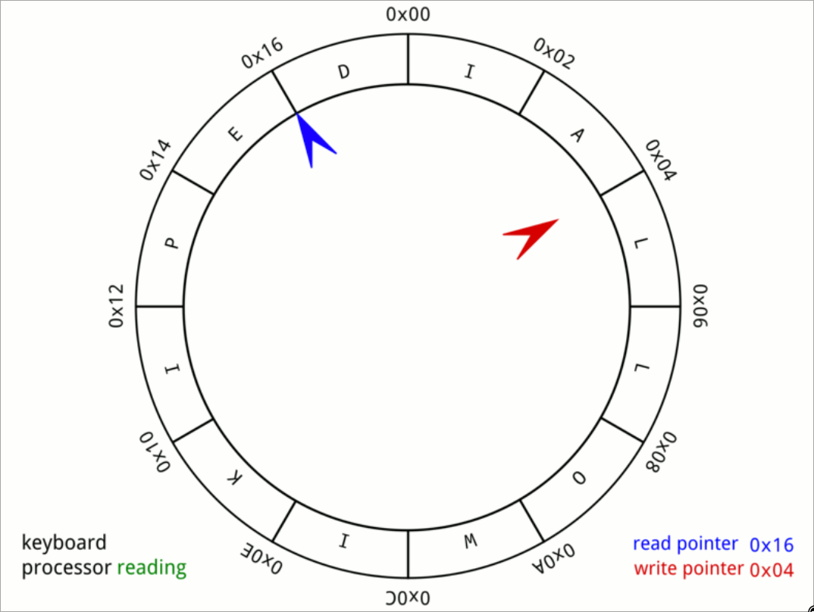

# Stacks Intro 

A stack is a data structure with the **"first in, last out"** **(FILO)** property.

## Operations 

It supports three operations:

- **Insert** (or "Push"): Putting an item into the stack.
- **Peek**: Look at the top item of the stack (the last inserted item that's not removed).
- **Remove** (or "Pop"): Remove the top item of the stack.

# Queue Intro

A queue follows **"First in, First Out" (FIFO)** property.

## Operations 

It supports three operations:

- Insert (or "Push"): Putting an item into the end of the queue.
- Peek: Look at the first item of the queue.
- Remove (or "Pop"): Remove the first item of the queue.

# Deques

Imagine a bookshelf where you can add or remove books from both ends with ease. 
This concept is a practical representation of a deque (pronounced "deck"), a contraction of **"Double-Ended QUEue."**

## Operations

It supports six operations:

- **Insert front**(or "Push front"): Putting an item in the beginning of the deque.
- **Insert back**(or "Push back"): Putting an item in the end of the deque.
- **Peek front**: Look at the first item of the deque.
- **Peek back**: Look at the last item of the deque.
- **Remove front**(or "Pop front"): Removing the item at the beginning of the deque.
- **Remove back**(or "Pop back"): Removing the item at the end of the deque.

## Things to know 

- Most modern programming languages offer a built-in queue data structure. 
- They often use a dynamic array as its underlying data structure (although they can also use a double-linked list, like Python's deque class). 
- When using these built-in data structures, you won't have to worry about deques overflowing because the resizing of the array is handled for you.

> ### Circular Buffer 
> A circular buffer, circular queue, cyclic buffer or ring buffer is a data structure that uses a single, fixed-size buffer as if it were connected end-to-end. This structure lends itself easily to buffering data streams. Below is a simple representation of how this works

Basically if the pointer reaches the end of the array it's set again to the start of the array.
